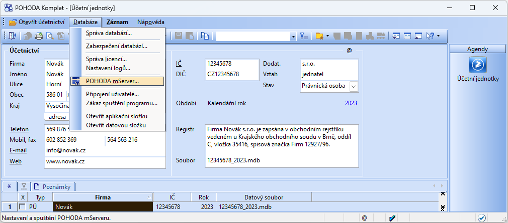
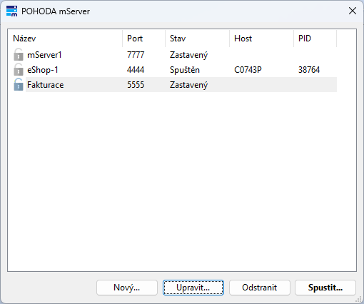
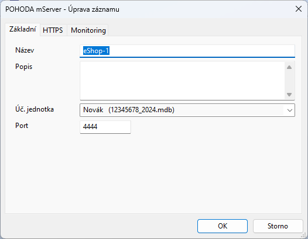
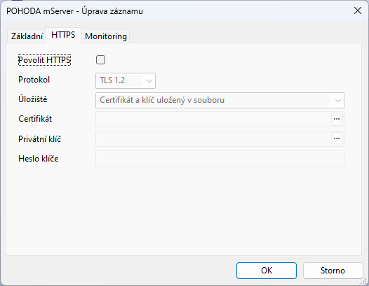
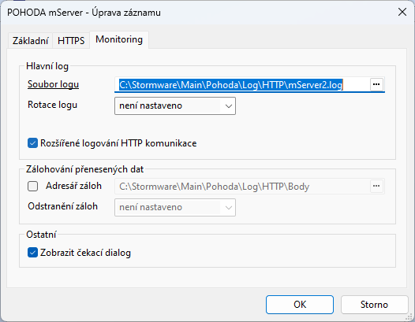

Pohoda MCP Server
==================

MCP server pro účetní software [Pohoda](https://www.stormware.cz/pohoda/) od Stormware.
Komunikuje s Pohodou přes [mServer XML API](https://www.stormware.cz/pohoda/xml/mserver/).

Propojte svého AI asistenta přímo s účetnictvím. Ptejte se na faktury, procházejte
adresář, kontrolujte zásoby, vytvářejte nové doklady nebo si nechte vytisknout
fakturu do PDF. Stačí napsat, co potřebujete, a MCP server se postará o komunikaci
s Pohodou.


Požadavky
---------

- PHP 8.1+
- ext-curl, ext-dom, ext-simplexml
- Pohoda s aktivním mServerem (schéma verze 2)


Nastavení mServeru v Pohodě
---------------------------

Před použitím MCP serveru je potřeba v Pohodě zapnout a nakonfigurovat mServer.

### 1. Otevření správy mServeru

V programu Pohoda otevřete agendu **Účetní jednotky**, v menu zvolte
**Databáze > POHODA mServer**.



### 2. Správa konfigurací

Otevře se dialogové okno se seznamem konfigurací mServeru.
Pro každou konfiguraci je uveden název, port, stav spuštění, host a PID.



### 3. Vytvoření nové instance

Klikněte na **Nový** a na záložce **Základní** nastavte:

- **Název** mServeru
- **Účetní jednotku**, se kterou bude mServer komunikovat
- **Port** pro komunikaci (výchozí 444)



Na záložce **HTTPS** lze zapnout zabezpečenou komunikaci:



Na záložce **Monitoring** lze zapnout logování komunikace:



### 4. Spuštění

Vyberte konfiguraci a klikněte na **Spustit** (nebo dvakrát klikněte na záznam).
mServer začne naslouchat na nastaveném portu.

Alternativně lze mServer ovládat z příkazové řádky pomocí přepínače `/HTTP`
nad `pohoda.exe`. Jako poslední parametr se uvádí název konfigurace (v uvozovkách,
pokud obsahuje mezery):

```powershell
& "C:\Program Files (x86)\STORMWARE\POHODA\Pohoda.exe" /HTTP start "eShop-1"
& "C:\Program Files (x86)\STORMWARE\POHODA\Pohoda.exe" /HTTP stop "eShop-1"
& "C:\Program Files (x86)\STORMWARE\POHODA\Pohoda.exe" /HTTP restart "eShop-1"
& "C:\Program Files (x86)\STORMWARE\POHODA\Pohoda.exe" /HTTP list
```

Další příkazy: `stop /f` (vynucené ukončení), `list:xml` (výpis konfigurací do XML).
Pro automatické spuštění při startu systému Stormware doporučuje **Plánovač úloh
Windows** (ne Windows službu).

Podrobnosti viz [dokumentace Stormware](https://www.stormware.cz/pohoda/xml/mserver/spusteni/).


Instalace MCP serveru
---------------------

```bash
git clone https://github.com/dg/pohoda-mcp.git
cd pohoda-mcp
composer install
```


Konfigurace
-----------

Server se konfiguruje přes proměnné prostředí:

| Proměnná             | Popis                                                | Výchozí                |
|----------------------|------------------------------------------------------|------------------------|
| `POHODA_URL`         | URL mServeru                                         | `http://localhost:444` |
| `POHODA_ICO`         | ICO účetní jednotky                                  |                        |
| `POHODA_USERNAME`    | Uživatelské jméno pro mServer                        |                        |
| `POHODA_PASSWORD`    | Heslo                                                |                        |
| `POHODA_EXE_PATH`    | Cesta k `Pohoda.exe` pro autostart mServeru (volitelné) |                     |
| `POHODA_CONFIG_NAME` | Název konfigurace mServeru pro autostart (volitelné) |                        |

Pokud jsou nastaveny `POHODA_EXE_PATH` a `POHODA_CONFIG_NAME`, server před prvním
tool callem ověří, že mServer běží — pokud ne, sám ho spustí přes `pohoda.exe /HTTP start`.
Při ukončení MCP serveru ho zase zastaví, ale jen pokud ho sám startoval (pokud
mServer už běžel, necháme ho běžet). Windows-only (mServer je součást Pohody).


Použití v agentech (např. Claude Code)
--------------------------------------

Přidejte do `.mcp.json` nebo do project settings:

```json
{
	"mcpServers": {
		"pohoda": {
			"command": "php",
			"args": ["/cesta/k/pohoda-mcp/server.php"],
			"env": {
				"POHODA_URL": "http://localhost:444",
				"POHODA_ICO": "12345678",
				"POHODA_USERNAME": "Admin",
				"POHODA_PASSWORD": "",
				"POHODA_EXE_PATH": "C:\\Program Files (x86)\\STORMWARE\\POHODA\\Pohoda.exe",
				"POHODA_CONFIG_NAME": "mServer1"
			}
		}
	}
}
```

Poslední dvě proměnné jsou volitelné — slouží k automatickému spuštění mServeru
při prvním tool callu (viz výše).


Dostupné nástroje
-----------------

### pohoda_status

Ověří, jestli mServer běží a odpovídá. Základní volání vrací pouze stručný text
z `GET /status` (Pohoda odpovídá prostým stringem, ne XML). S parametrem
`companyDetail=true` navíc přes autentizovaný dotaz vrátí název účetní jednotky,
název databáze a aktuální účetní rok.


### pohoda_list

Hlavní nástroj pro čtení dat. Vrací záznamy z libovolné agendy s možností filtrování.

**Podporované agendy:**

| Agenda | Popis | | Agenda | Popis |
|---|---|---|---|---|
| `invoice` | faktury\* | | `prijemka` | příjemky |
| `order` | objednávky | | `vydejka` | výdejky |
| `addressbook` | adresář | | `prodejka` | prodejky |
| `stock` | zásoby | | `prevodka` | převodky |
| `voucher` | pokladní doklady | | `vyroba` | výroba |
| `bank` | banka | | `accountancy` | účetní deník |
| `contract` | zakázky | | `store` | sklady |
| `intDoc` | interní doklady | | `bankAccount` | bankovní účty |
| `offer` | nabídky | | `cashRegister` | pokladny |
| `enquiry` | poptávky | | `numericalSeries` | číselné řady |
|  |  | | `centre` | střediska |
|  |  | | `activity` | činnosti |

\* Agenda `invoice` vyžaduje parametr `invoiceType`: `issuedInvoice` nebo `receivedInvoice`.

**Filtry pro doklady:**

| Parametr | Popis |
|---|---|
| `id` | ID záznamu |
| `dateFrom` / `dateTill` | rozsah dat (YYYY-MM-DD) |
| `company` | název firmy |
| `ico` | IČO firmy |
| `number` | číslo dokladu — přesná shoda celé hodnoty (ne substring) |
| `lastChanges` | záznamy změněné od data (YYYY-MM-DDThh:mm:ss) |

**Filtry pro zásoby** (navíc k výše uvedeným):

| Parametr | Popis |
|---|---|
| `code` | kód zásoby |
| `name` | název zásoby |
| `EAN` | čárový kód |
| `storage` | cesta ve členění skladu (např. "ZBOZI/Elektro") |
| `store` | zkratka skladu |
| `internet` | příznak "zobrazit na internetu" (true/false) |


### pohoda_create_invoice

Vytvoření vydané nebo přijaté faktury. Podporuje:
- adresu partnera přímo nebo vazbu na adresář (`partnerId`)
- variabilní symbol, datum splatnosti, datum zdanitelného plnění
- předkontaci, způsob platby, bankovní účet
- středisko, činnost, zakázku
- cizí měnu s kurzem
- položky s vazbou na skladovou kartu (`stockCode`)


### pohoda_create_address

Vytvoření záznamu v adresáři (firma/kontakt).


### pohoda_create_stock

Vytvoření skladové karty. Kromě základních údajů (kód, název, cena) podporuje:
- EAN, PLU pro pokladny
- příznaky pro prodej a e-shop
- popis, doplněk názvu, krátký název
- minimální a maximální zásobu, hmotnost
- dodavatele, záruku


### pohoda_create_order

Vytvoření přijaté nebo vydané objednávky s položkami.


### pohoda_print

Tisk nebo export do PDF libovolného záznamu. Umí:
- tisk na tiskárnu (výchozí nebo konkrétní)
- export do PDF souboru na serveru (`pdfPath` je povinný)
- vrácení PDF jako Base64 přímo v odpovědi
- odeslání PDF emailem (s předmětem a textem)

Agenda se zadává česky: `vydane_faktury`, `prijate_faktury`, `zasoby`, `adresar`,
`pokladna`, `banka`, `interni_doklady`, `zakazky`, `vydejky`, `prijemky`, `prodejky`,
`vydane_objednavky`, `prijate_objednavky`, `vydane_nabidky`, `prijate_nabidky` atd.

ID tiskové sestavy (`reportId`) se liší podle instalace a vlastních úprav.
V Pohodě ho zjistíte v **Editoru tiskových sestav** (menu Soubor → Tiskové sestavy),
kde u každé sestavy vidíte sloupec ID, nebo přes pravé tlačítko myši na sestavě
v dialogu tisku → **Vlastnosti**. Standardní dodávané sestavy mají ID v řádech
stovek až tisíců (typicky 200–3000+).


### pohoda_raw_xml

Odeslání libovolného XML. Pokrývá případy, na které ostatní nástroje nestačí.
XML se vloží přímo do `<dat:dataPackItem>` obálky, musí tedy obsahovat vlastní
namespace deklarace.


Použití z PHP kódu (bez MCP)
----------------------------

Knihovnu lze použít i přímo jako PHP klienta pro mServer, nezávisle na MCP.
Hodí se pro vlastní skripty, cronjoby nebo integraci do existující aplikace.

```php
use DG\Pohoda\PohodaClient;

$client = new PohodaClient(
    url: 'http://localhost:444',
    ico: '12345678',
    username: 'Admin',
    password: '',
);

// Najdi fakturu podle čísla dokladu
$list = $client->listRecords('invoice', ['number' => '26010192'], 'issuedInvoice');
$faId = (int) $list->items[0]->data['invoice'][0]['invoiceHeader']['id'];

// Vytiskni ji do PDF
$client->printRecord([
    'agenda' => 'vydane_faktury',
    'recordId' => $faId,
    'reportId' => 3000,
    'pdfPath' => 'C:\\tmp\\faktura.pdf',
]);
```

Veřejné metody `PohodaClient`: `getStatus()`, `listRecords()`, `createInvoice()`,
`createAddress()`, `createStock()`, `createOrder()`, `printRecord()`, `sendRawXml()`.


### Spouštění a zastavování mServeru

Pokud skript nemůže předpokládat, že je mServer už spuštěný, hodí se třída
`MServerController`. Je to tenký obal nad `pohoda.exe /HTTP start|stop`, který
spouští Pohodu non-blocking a po startu polluje `PohodaClient::getStatus()`,
dokud mServer nezačne odpovídat. Windows-only.

Nejjednodušší cesta je předat ho `PohodaClient`u — ten si pak sám lazy nastartuje
mServer před prvním HTTP requestem a při destrukci ho zase zastaví (jen pokud
ho sám startoval; pokud už běžel, necháme ho běžet):

```php
use DG\Pohoda\MServerController;
use DG\Pohoda\PohodaClient;

$client = new PohodaClient(url: 'http://127.0.0.1:555', ico: '12345678', username: 'Admin', password: '');
$client->setController(new MServerController(
    exePath: 'C:\Program Files (x86)\STORMWARE\POHODA\Pohoda.exe',
    configName: 'mServer1',
));

// ... práce s $client — autostart se postará o sebe ...
```

Pokud chceš lifecycle řídit ručně, controller umí stejné věci přímo:

```php
$ctrl = new MServerController(exePath: '...', configName: 'mServer1');

$wasRunning = false;
try {
    $client->getStatus();
    $wasRunning = true;
} catch (\RuntimeException) {
    $ctrl->start($client);  // vrátí se až když mServer odpovídá (nebo vyhodí po timeoutu)
}

// ... práce s $client ...

if (!$wasRunning) {
    $ctrl->stop();
}
```

Při volání HTTP endpointů používej `http://127.0.0.1:555`, ne `http://localhost:555`
— PHP resolver zkouší pro `localhost` nejdřív IPv6 (`::1`), kam mServer nenaslouchá,
a čeká se zbytečně na timeout.

Veřejné metody `MServerController`:

- `start(PohodaClient $client, int $timeoutSeconds = 30)` — spustí Pohodu
  s `/HTTP start`, čeká až HTTP status API odpoví. Při timeoutu vyhodí
  `RuntimeException`.
- `stop()` — pošle `/HTTP stop` fire-and-forget, nečeká na ukončení.


Řešení problémů
---------------

| Symptom | Pravděpodobná příčina |
|---|---|
| `Curl Error: Connection refused` | mServer neběží; spusť ho v Pohodě nebo přes `pohoda.exe /HTTP start` |
| `HTTP 401` | Chybné `POHODA_USERNAME` / `POHODA_PASSWORD` |
| Odpověď je HTML s přihlašovací stránkou | Uživatel v Pohodě nemá práva na mServer nebo je agenda otevřená jinou instancí |
| `state="error"` + `note="Nepodařila se validace dokumentu podle schématu"` | Špatná struktura XML — typicky zaměněný namespace nebo chybějící povinný element; text chyby ukazuje na element |
| `listRecords` vrací prázdný seznam | mServer je připojený na jinou účetní jednotku/rok, než kde doklad žije (zkontroluj `pohoda_status` s `companyDetail=true`) |
| `pdfPath` je vytvořen, ale nejde otevřít (0 B) | mServer nemá práva zapisovat na dané místo — zkus výchozí `D:\Data\ucto\Tisk\` nebo dočasný adresář uživatele, pod kterým Pohoda běží |
| `Print` vrací OK, ale PDF nevzniká | `reportId` neexistuje v instalaci; ověř ID v Editoru tiskových sestav |


Struktura projektu
------------------

```
server.php                 vstupní bod MCP serveru (stdio transport)
src/
	McpTools.php             tenký MCP adaptér (#[McpTool] atributy)
	PohodaClient.php         HTTP klient a doménové metody pro mServer API
	XmlBuilder.php           stavba XML požadavků přes XMLWriter
	Response.php             parsovaná odpověď z mServeru
	ResponseItem.php         jeden záznam z odpovědi
	MServerController.php    spouštění a zastavování mServeru přes pohoda.exe
```


Licence
-------

MIT
